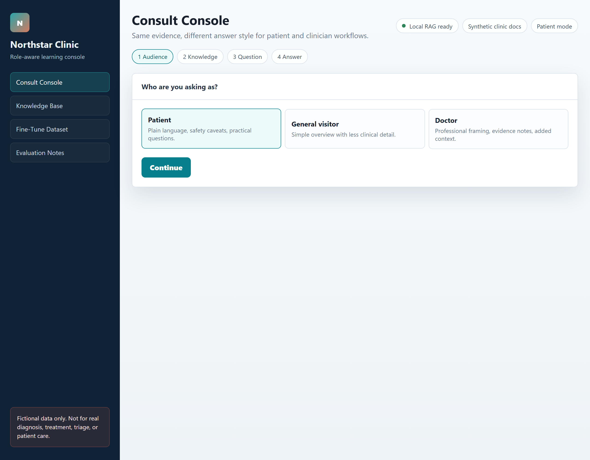
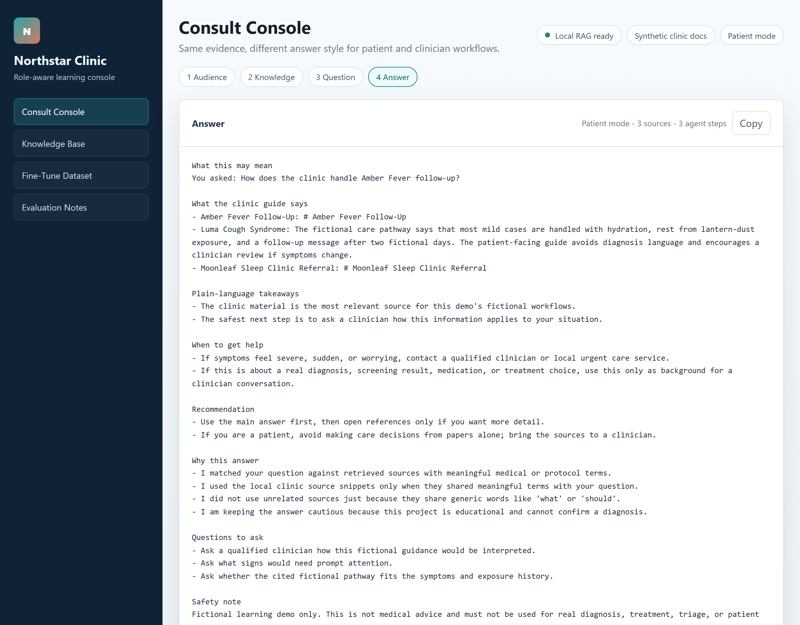
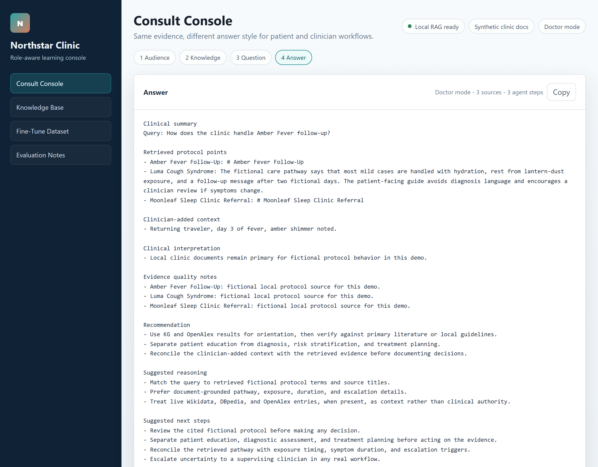
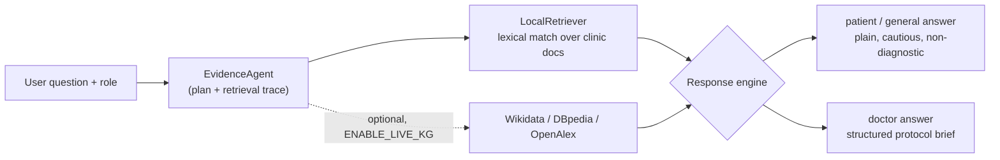

# Fictional Clinic — Role-Aware Medical Knowledge Agent

[](https://github.com/Diya-sudheer/medical-knowledge-agent/actions/workflows/ci.yml)

[](LICENSE)

A retrieval-augmented agent that answers the **same medical question differently
depending on who is asking** — a patient gets plain, cautious language; a doctor
gets a structured, protocol-style brief — grounded in retrieved sources, with an
evaluation suite that proves it.

> ⚠️ **Intentionally fake medical data.** Every condition here is invented
> (Luma Cough Syndrome, Amber Fever, …). Do not use this for real diagnosis,
> treatment, triage, or patient care.



## Why this project is interesting

- **Role-aware generation** — one retrieval, three audiences (`patient`,
  `general`, `doctor`), with measurable separation between them.
- **Grounded + honest** — answers cite the retrieved source, and the agent
  *abstains* (returns nothing, then says so) on questions it has no evidence for,
  instead of hallucinating a protocol.
- **Provably good, not just claimed-good** — a deterministic, offline
  [evaluation suite](evaluation/RESULTS.md) scores retrieval and response quality
  on every CI run.

## Evaluation results

Measured by [`evaluation/run_eval.py`](evaluation/run_eval.py) over **16 in-scope
questions (8 of them hard paraphrases that never name the condition) + 6
out-of-scope questions**. Fully deterministic and offline — regenerate the exact
numbers yourself with `python -m evaluation.run_eval`.

| Retrieval (RAG) | Score |  | Role-aware responder | Score |
| --- | --- | --- | --- | --- |
| Top-1 accuracy | **100%** |  | Heading compliance | **100%** |
| Recall@3 | **100%** |  | Role separation | **100%** |
| MRR | **1.00** |  | Answer grounded in source | **100%** |
| Out-of-scope abstention | **100%** |  | Safety disclaimer present | **100%** |
|  |  |  | Safe abstention (no fabrication) | **100%** |

These scores are enforced as a [pytest guardrail](tests/test_evaluation.py), so a
change that degrades retrieval or role behaviour fails CI. Full report:
[`evaluation/RESULTS.md`](evaluation/RESULTS.md).

## Real-data retrieval benchmark (MedQuAD)

The fictional eval above is deterministic and scores 100% by design. To test
retrieval on a *real, messy* corpus, a second track runs over
[MedQuAD](https://github.com/abachaa/MedQuAD) — 1,500 real medical Q&A passages
from NIH / NCI / CDC — and pits the lexical retriever (BM25) against an embedding
retriever (MiniLM, a real neural model). Real questions, real **sub-100%** numbers:

| Metric | BM25 (lexical) | MiniLM (semantic) | Δ |
| --- | --- | --- | --- |
| Recall@1 | 0.657 | **0.750** | +9.3 pts |
| Recall@5 | 0.864 | **0.881** | +1.7 pts |
| Recall@10 | 0.880 | **0.900** | +2.0 pts |
| MRR@10 | 0.747 | **0.808** | +6.1 pts |

Semantic retrieval wins most at **Recall@1** — it finds the right passage when the
question and answer use *different words for the same idea* (the report lists real
examples BM25 missed entirely but MiniLM ranked #1). Full write-up:
[`benchmarks/medquad/RESULTS.md`](benchmarks/medquad/RESULTS.md). Reproduce it:

```bash
pip install -e ".[benchmark]"
python -m benchmarks.medquad.ingest        # downloads + parses MedQuAD
python -m benchmarks.medquad.run_benchmark
```

## The same question, two roles

Both panels below answer the **identical** question — *"How does the clinic
handle Amber Fever follow-up?"* — from the **same retrieved sources**. Only the
audience differs.

<table>
<tr>
<th>🧑 Patient — plain, cautious, safety-first</th>
<th>🩺 Doctor — structured clinical brief</th>
</tr>
<tr>
<td valign="top"></td>
<td valign="top"></td>
</tr>
</table>

The retriever returns the same facts; the responder rewrites tone, structure, and
depth for the role — and the doctor view additionally folds in clinician-supplied
context. The [evaluation](#evaluation-results) measures this separation so it
can't silently break.

## Architecture



The default response engine is a **deterministic local template engine** (no API
key needed), which is what makes the evaluation reproducible. Set `USE_OPENAI=true`
to swap in an LLM for generation while keeping the same retrieval and prompts.

## Quick start

```powershell
python -m venv .venv
.\.venv\Scripts\Activate.ps1
pip install -e ".[dev]"
copy .env.example .env
uvicorn fictional_clinic.app:app --reload
```

Open http://127.0.0.1:8000.

By default `USE_OPENAI=false`, so the app uses the deterministic local engine.
To use OpenAI generation instead:

```text
OPENAI_API_KEY=your_key
USE_OPENAI=true
OPENAI_MODEL=gpt-4.1-mini
```

To let the agent query Wikidata, DBpedia, and OpenAlex for live context:

```text
ENABLE_LIVE_KG=true
```

Each request still decides whether to include the live lookup, and those results
are treated as background context, not medical authority.

## Run the tests and the evaluation

```powershell
pytest                          # unit + integration tests + eval guardrail
python -m evaluation.run_eval   # regenerate evaluation/RESULTS.md and results.json
```

## Generate fine-tuning data

```powershell
clinic-generate-ft-data --output data/generated/role_examples.jsonl
```

The generated JSONL contains synthetic patient and doctor examples based on the
fictional knowledge base. It is a starter dataset, not production training data.

## Project layout

```text
src/fictional_clinic/
  app.py              FastAPI app and endpoints
  config.py           environment settings
  models.py           request/response schemas and role enum
  prompts.py          role-specific prompts
  kg.py               optional Wikidata/DBpedia/OpenAlex clients
  agent.py            evidence gathering and retrieval trace
  rag.py              local document loading and retrieval
  responder.py        local (deterministic) and OpenAI response engines
  finetune_data.py    synthetic JSONL generator
  web/index.html      minimal browser UI
data/clinic_docs/     fictional clinic knowledge base
evaluation/           gold cases, metrics runner, and generated report
tests/                unit, integration, and evaluation-threshold tests
```

## Limitations and roadmap

This is an educational project, and the evaluation is honest about where it would
break:

- **Retrieval is lexical** (term overlap + title boost + lightweight stemming).
  Adding the stemmer was a measured decision, not a guess: on a held-out slice of
  morphological-variant queries (where the link word only appears as a plural or
  verb form, e.g. *"interruptions"* vs the document's *"interruption"*), it lifts
  top-1 accuracy from **0% → 100%** with no regression on the in-scope set — see
  the [ablation table](evaluation/RESULTS.md#retrieval-robustness-does-stemming-help-ablation).
  The fictional pipeline still matches words, not meaning — but that gap is now
  **built and measured on real data**: the
  [MedQuAD benchmark](benchmarks/medquad/RESULTS.md) pits this lexical approach
  (BM25) against an embedding retriever over 1,500 real medical passages, where
  semantics lifts **Recall@1 from 0.66 → 0.75**.
- **The default engine is template-based**, which guarantees structure but not
  fluency. The OpenAI path adds fluency; evaluating *that* output needs an
  LLM-as-judge or human rubric, which the current deterministic suite does not do.
- **Tiny fictional knowledge base** (4 documents) keeps the core demo fast and
  deterministic. For scale and realism, the
  [MedQuAD benchmark](benchmarks/medquad/RESULTS.md) runs the retrievers over
  1,500 real NIH/CDC medical passages instead.

A real patient/doctor assistant would additionally need clinical governance,
expert review, monitoring, PHI controls, audit logging, security review,
emergency-escalation behaviour, and regulatory analysis. None of that is present
or implied here.
